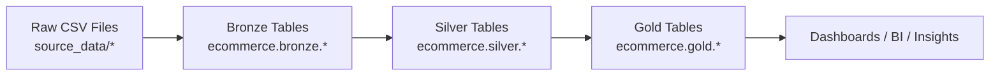

<!-- =========================================================
     END-TO-END DATABRICKS RETAIL PROJECT (AWS) — PREMIUM README
     Repo: gaurav-singh-tech/END--TO--END-DATABRICKS-RETAIL-PROJECT-using-AWS
     ========================================================= -->

<div align="center">


<p align="center">
  
  
  
  
  
</p>

<p align="center">
  <a href="#-project-highlights">
    
  </a>
  <a href="#-architecture--data-flow">
    
  </a>
  <a href="#-how-to-run-in-databricks">
    
  </a>
  <a href="#-notebooks-in-this-repo">
    
  </a>
</p>

<p>
  <b>Author:</b> Gaurav Singh Bisht<br/>
  <sub>Retail analytics engineering on Databricks — from raw files to BI-ready gold tables.</sub>
</p>

</div>

---

## 🔥 Project Highlights
This repository implements an **end-to-end retail data pipeline** on **Databricks** using the **Medallion Architecture**:

- **Bronze Layer**: Ingest raw CSVs, apply schemas, add ingestion metadata, write **Delta tables**
- **Silver Layer**: Clean, standardize, validate & transform **dimension** and **fact** tables
- **Gold Layer**: Build **business-ready (BI-ready)** dimension/fact datasets for analytics dashboards

✅ Built with **PySpark + Delta tables**  
✅ Production-style layer separation (Bronze/Silver/Gold)  
✅ Uses Databricks **Catalog/Schema** organization (`ecommerce.bronze|silver|gold`)  
✅ Includes a realistic multi-table retail dataset (brands, categories, products, customers, calendar, order_items)

---

## 🧠 What You’ll Learn (Recruiter-friendly)
| Skill Area | What this project demonstrates |
|---|---|
| Data Engineering | End-to-end pipeline design, medallion modeling, table layering |
| Spark | Schema enforcement, transformations, cleansing, joins, column hygiene |
| Lakehouse | Delta tables & curated datasets for BI |
| Organization | Notebook-driven workflow + clear dataset separation |

---

## 🧱 Architecture & Data Flow
### Medallion Architecture (Bronze → Silver → Gold)



### Layers (Quick Summary)
| Layer | Purpose | Typical Output |
|---|---|---|
| Bronze | Ingest as-is + add metadata | `brz_*` Delta tables |
| Silver | Clean, normalize, validate | `slv_*` Delta tables |
| Gold | BI-ready semantic layer | `gld_*` curated tables |

---

## 🗃️ Dataset Included (in repo)
Your repo contains sample retail data in `source_data/`:

| Dataset | Location | Notes |
|---|---|---|
| Brands | `source_data/brands/brands.csv` | dimension |
| Category | `source_data/category/category.csv` | dimension |
| Customers | `source_data/customers/customers.csv` | dimension (large) |
| Date | `source_data/date/date.csv` | calendar dimension |
| Products | `source_data/products/products.csv` | dimension |
| Order Items | `source_data/order_items/landing/*.csv` | fact table split by date |

> The order items folder contains many daily CSV files. GitHub’s API listing may show only a subset in one response; browse the folder in GitHub UI for the full list:  
> `source_data/order_items/landing/`

---

## 📒 Notebooks in This Repo
Run the notebooks in this order:

| Step | Notebook | Goal |
|---:|---|---|
| 0 | `setup_catalog.ipynb` | Create catalog + schemas (`ecommerce`, `bronze/silver/gold`) |
| 1 | `1_dim_bronze.ipynb` | Ingest **dimension** raw files into Bronze Delta tables |
| 2 | `1_fact_bronze.ipynb` | Ingest **fact** raw files (order items) into Bronze |
| 3 | `2_dim_silver.ipynb` | Clean & transform **dimension** tables to Silver |
| 4 | `2_fact_silver.ipynb` | Clean & transform **fact** tables to Silver |
| 5 | `3_dim_gold.ipynb` | Build BI-ready **dimension** tables in Gold |
| 6 | `3_fact_gold.ipynb` | Build BI-ready **fact** tables in Gold |

---

## 🧩 What’s Happening Inside Each Layer (high-level)

### 🟫 Bronze (Raw → Delta)
- Enforces schemas with `StructType`
- Reads CSVs from the configured raw paths
- Adds ingestion metadata (example: `_source_file`, `ingested_at`, `file_name`, `ingest_timestamp`)
- Writes Delta tables like:
  - `ecommerce.bronze.brz_brands`
  - `ecommerce.bronze.brz_category`
  - `ecommerce.bronze.brz_products`
  - `ecommerce.bronze.brz_customers`
  - `ecommerce.bronze.brz_calendar`
  - `ecommerce.bronze.brz_order_items`

### 🥈 Silver (Clean + Standardize)
Typical transformations include:
- trimming text fields (`trim`)
- standardizing codes (example: removing special characters)
- fixing data quality issues (type anomalies like “Two” in quantity)
- ensuring consistent shapes for downstream joins

### 🥇 Gold (BI-ready)
- Builds curated datasets meant for analytics and dashboards
- Typically joins dimensions + facts into star-schema friendly tables
- Focus: “one truth layer” for business metrics

---

## 🏗️ Repository Structure
```text
END--TO--END-DATABRICKS-RETAIL-PROJECT-using-AWS/
├─ setup_catalog.ipynb
├─ 1_dim_bronze.ipynb
├─ 1_fact_bronze.ipynb
├─ 2_dim_silver.ipynb
├─ 2_fact_silver.ipynb
├─ 3_dim_gold.ipynb
├─ 3_fact_gold.ipynb
├─ source_data/
│  ├─ brands/brands.csv
│  ├─ category/category.csv
│  ├─ customers/customers.csv
│  ├─ date/date.csv
│  ├─ products/products.csv
│  └─ order_items/landing/order_items_YYYY-MM-DD.csv ...
└─ README.md
```

---

## ▶️ How to Run in Databricks
### Prerequisites
- A Databricks workspace (on AWS)
- Cluster with Spark enabled
- Unity Catalog enabled (recommended if using catalogs/schemas)
- Upload/attach this repo or import notebooks

### Execution
1. Run `setup_catalog.ipynb` to create:
   - Catalog: `ecommerce`
   - Schemas: `bronze`, `silver`, `gold`
2. Run Bronze ingestion notebooks:
   - `1_dim_bronze.ipynb`
   - `1_fact_bronze.ipynb`
3. Run Silver transformations:
   - `2_dim_silver.ipynb`
   - `2_fact_silver.ipynb`
4. Run Gold modeling:
   - `3_dim_gold.ipynb`
   - `3_fact_gold.ipynb`

---

## 🧪 Example: Table Naming Convention
| Layer | Example Tables |
|---|---|
| Bronze | `ecommerce.bronze.brz_*` |
| Silver | `ecommerce.silver.slv_*` |
| Gold | `ecommerce.gold.gld_*` |

---

## 📌 Suggested KPIs for BI (Gold Layer Use Cases)
If you’re building dashboards on top of Gold, typical metrics include:

- Revenue by date / category / brand / channel
- Top products by sales volume
- Customer cohort behavior
- Discount impact vs revenue
- Tax + net sales analysis

---

## 🔐 Notes on AWS Integration (S3)
This project conceptually uses **Amazon S3** as the data lake source (common Databricks-on-AWS pattern).  
If your environment reads from S3 directly, ensure:
- IAM role / instance profile attached to cluster
- S3 paths configured (instead of local/Volumes paths)

> If you share your exact S3 bucket path structure used in your video, I can tailor the README “AWS Setup” section to match it exactly.

---

## 🧾 Disclaimer
This project is for learning and portfolio demonstration. Production systems typically add:
- orchestrations (Workflows / Airflow)
- automated testing (Great Expectations / Deequ)
- data lineage & governance (Unity Catalog)
- monitoring & alerting

---

<div align="center">

### ⭐ If this project helped you, star the repo and connect with me!

</div>
